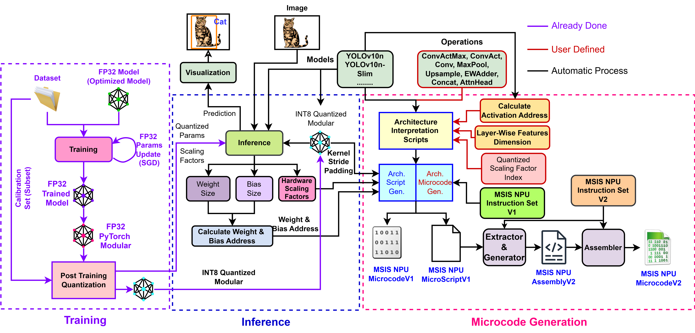

# MicroCompiler Implementation for MSIS NPUv4
This MicroCompiler is combined of two different machine language version (MicrocodeV1 and MicrocodeV2). It is divided into 3 different phases: Training, Inference, Microcode Generation (MicrocodeV1 Generator and MicrocodeV2 Generator with configuration as a manual scripts).

## MicroCompiler Architecture



### Supporting Models
- YOLOv10n-Slim
- YOLOv10n

### MicrocodeV2
For more details related to Assembly Languages, Assembler, and MicrocodeV2, Please kindly reference to the following link: 
* [MicrocodeV2](https://github.com/ultralytics):

## Pre-Requisite 
```bash
$ conda create -n simcompiler python==3.10.0
$ pip install torch torchvision torchaudio
$ pip install numpy scipy thop tabulate argparse
$ pip install ultralytics ultralytics-thop termcolor opencv-python onnx onnxruntime 
```

## Usage
```bash
git clone https://github.com/Thaising-Taing/MSIS_NPU_MicroCompiler.git
``` 

For Running MicroCompiler, <model_name> can be YOLOv10n or YOLOv10n_Slim

```python

python MicroCompiler.py --model_name <model_name> --output_dir <dir_name> --image_path <image_path>

```

For Debugging Purpose: 

```python

python MicroCompiler.py --model_name <model_name> --output_dir <dir_name> --image_path <image_path> --DEBUG True --DEBUG_Write True

```

## Take Home Message
If you want to extend to support more custom models, you can just add the new models into the MicroCompiler.py. Moreover, adding your calculating Activation Address into Model directory, and writing your own Architecture script for your custom models with listing down all the models' operations.

## Contact
Thaising Taing - thaisingtaing@chungbuk.ac.kr

## Acknowledgement
- [Sangbo Park](sangbopark@chungbuk.ac.kr)
- [Fawad Khan Yousufzai](https://github.com/gofky)

## References
* [Ultralytics](https://github.com/ultralytics): including all the YOLO models configurations 

## Citation
You can find more helpful information related to YOLOv10 from this following citation: 

```bibtex
@article{THU-MIGyolov10,
  title={YOLOv10: Real-Time End-to-End Object Detection},
  author={Ao Wang, Hui Chen, Lihao Liu, et al.},
  journal={arXiv preprint arXiv:2405.14458},
  year={2024},
  institution={Tsinghua University},
  license = {AGPL-3.0}
}
```